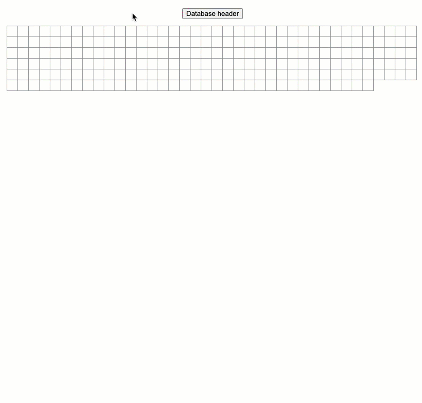

# Sqlite database file structure visualization

Basically, it dissects sqlite database btree file, and visulize the btree node(page) relationship and node(page) content.

## Run the application

- http_main --file test-data/Chinbook.db.4.analyze

## Visualization

- Open http://127.0.0.1:8080/static/index.html
- Move mouse around btree node(page), it shows parent node in green, and its children nodes in red.
- Mouse left click to show node(page) content in json format.
- Mouse right click to freeze the page relation regardless mouse move.

## Sample
